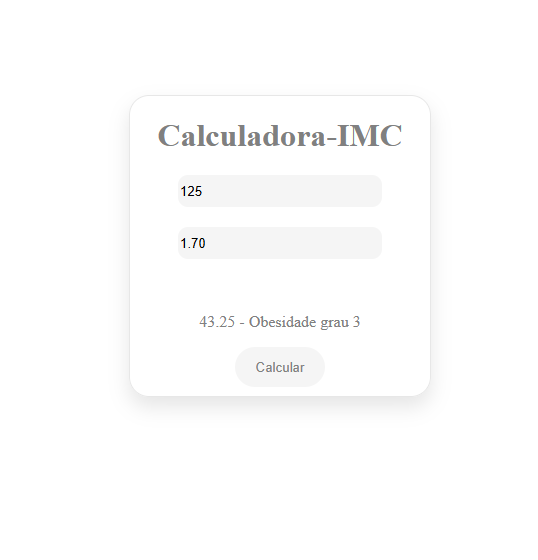

# 🧮 Calculadora de IMC

Uma calculadora simples de IMC (Índice de Massa Corporal) desenvolvida com [sua linguagem/framework]. Ideal para praticar lógica de programação, entrada de dados e manipulação de interface.

## 💡 O que é IMC?

O IMC é uma fórmula internacional usada para verificar se uma pessoa está com o peso ideal em relação à altura. A fórmula é:
IMC = peso (kg) / (altura (m))²


## 🔍 Classificação segundo a OMS

| IMC                | Classificação          |
|--------------------|------------------------|
| Menor que 18.5     | Abaixo do peso         |
| 18.5 – 24.9        | Peso normal            |
| 25 – 29.9          | Sobrepeso              |
| 30 – 34.9          | Obesidade grau I       |
| 35 – 39.9          | Obesidade grau II      |
| 40 ou mais         | Obesidade grau III     |

## 🚀 Como usar

1. Clone este repositório:

```bash
git clone https://github.com/seu-usuario/calculadora-imc.git
```
2. Abra o arquivo index.html no seu navegador.

3. Insira seu peso (em kg) e altura (em metros), clique em "Calcular", e veja o resultado.

## 🖥️ Tecnologias utilizadas

✅ HTML5

✅ CSS3

✅ JavaScript (puro)



